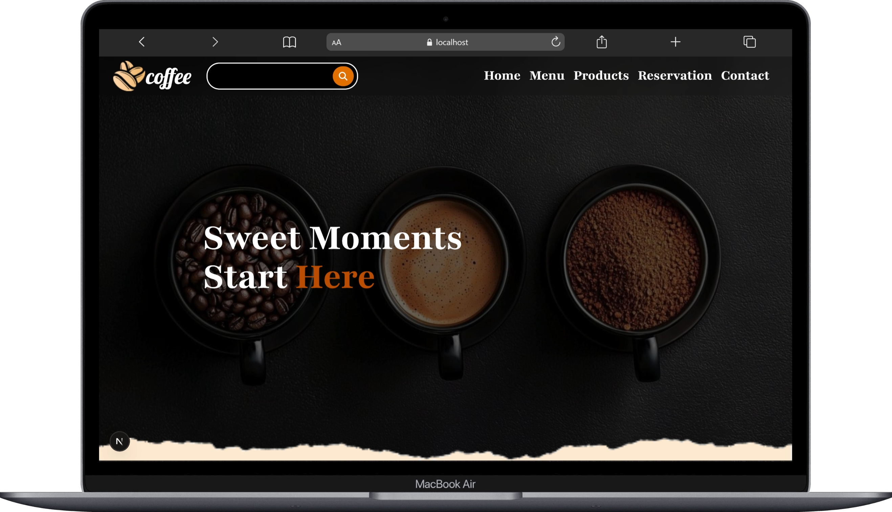
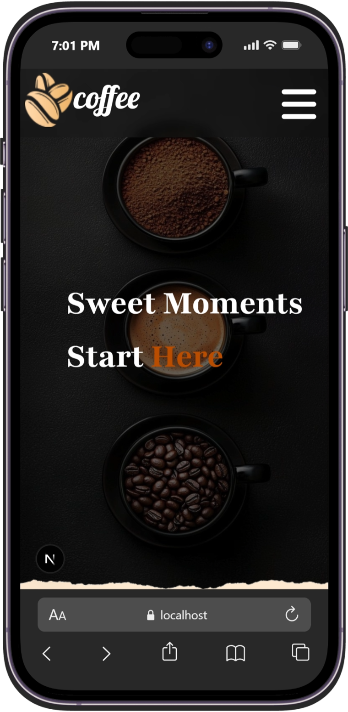

# ☕ Cafe Website

A modern and responsive cafe website built with **Next.js**, **React**, and **Tailwind CSS**.

The project includes a cafe menu, product selection, and an online table reservation system .

## 📸 Preview

  
  

## ✨ Features

- 📱 Fully responsive design
- 🏠 Modern cafe landing page
- ☕ Cafe menu and product sections
- ➕ Product quantity selection
- 📅 Online table reservation
- 🕐 Date and time selection
- 👥 Number of guests selection
- 📱 Responsive mobile navigation
- 🧩 Reusable React components

## 🛠️ Technologies

- **Next.js**
- **React**
- **JavaScript**
- **Tailwind CSS**
- **JSON Server**
- **HTML5**
- **CSS3**

## ⚙️ Getting Started

### 1-clone the repository
### 2-install dependencies
### 3-start json-server : npx json-server db.json
### 4-start the Next.js development server : npm run dev

